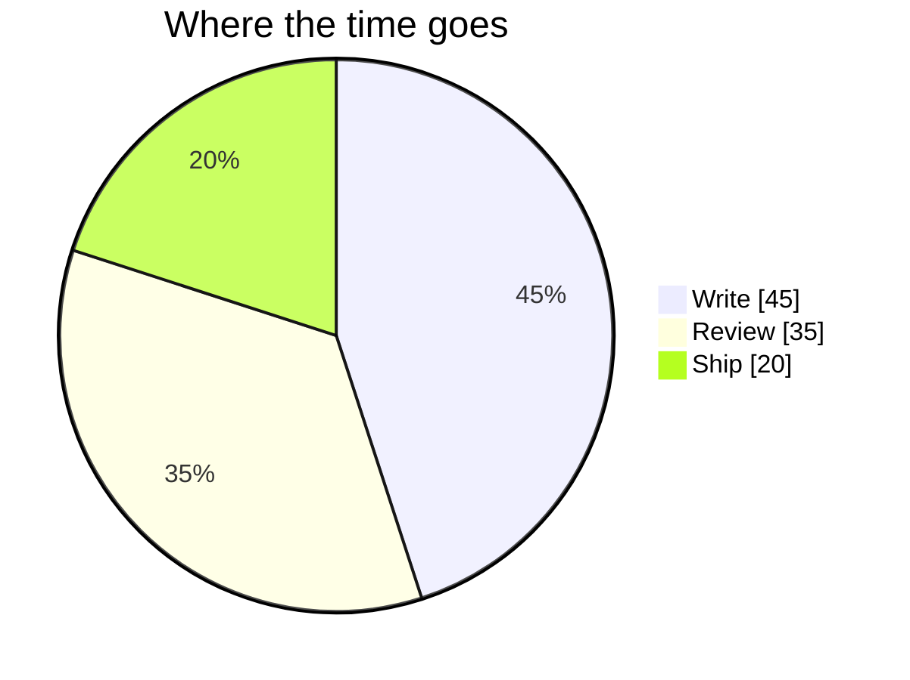
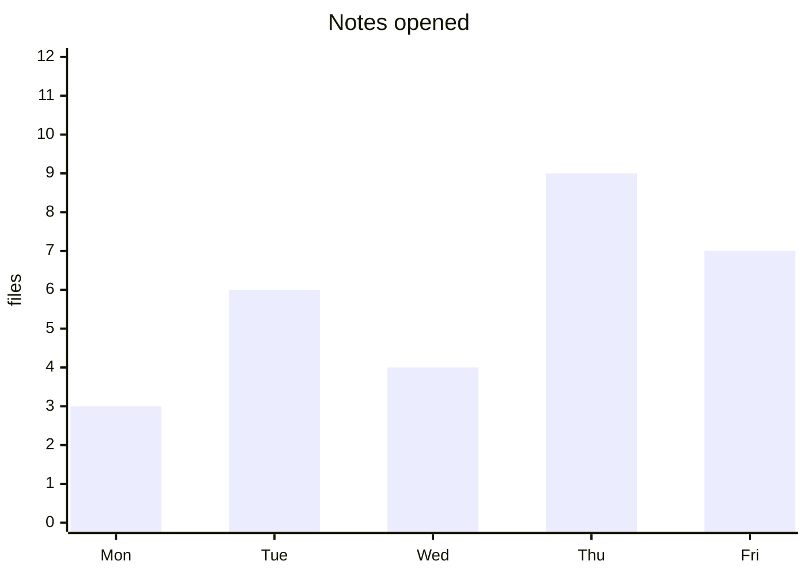
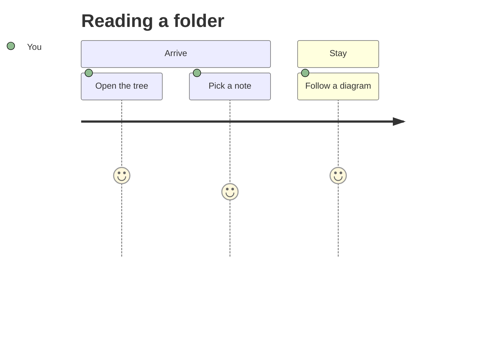
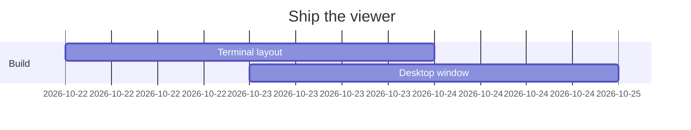
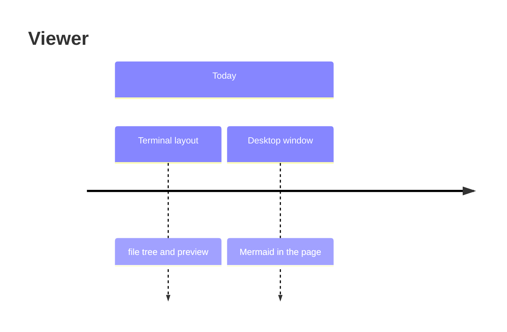
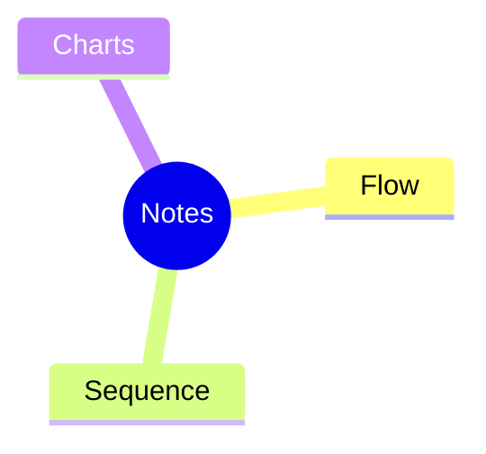

# Charts

```mermaid
pie showData
    title Where the time goes
    "Write" : 45
    "Review" : 35
    "Ship" : 20
```

```mermaid
xychart-beta
    title "Notes opened"
    x-axis [Mon, Tue, Wed, Thu, Fri]
    y-axis "files" 0 --> 12
    bar [3, 6, 4, 9, 7]
```

```mermaid
journey
    title Reading a folder
    section Arrive
      Open the tree: 5: You
      Pick a note: 4: You
    section Stay
      Follow a diagram: 5: You
```

```mermaid
gantt
    title Ship the viewer
    dateFormat YYYY-MM-DD
    section Build
    Terminal layout :a1, 2026-10-22, 2d
    Desktop window :a2, 2026-10-23, 2d
```

```mermaid
timeline
    title Viewer
    section Today
      Terminal layout : file tree and preview
      Desktop window : Mermaid in the page
```

```mermaid
mindmap
  root((Notes))
    Flow
    Sequence
    Charts
```
