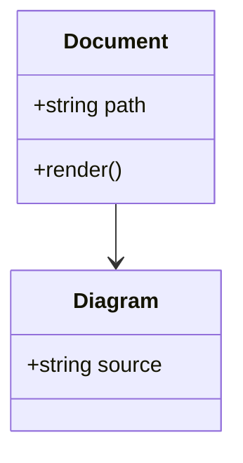
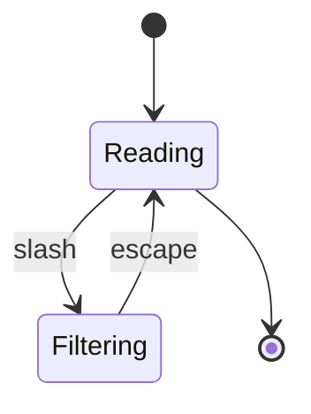
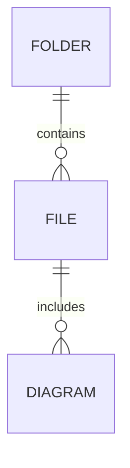
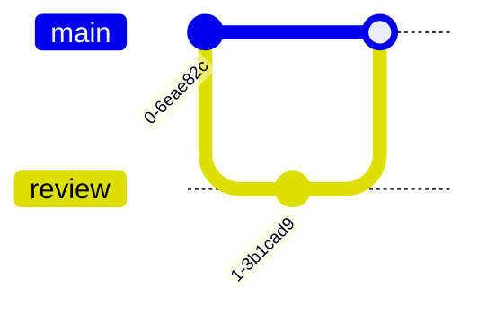
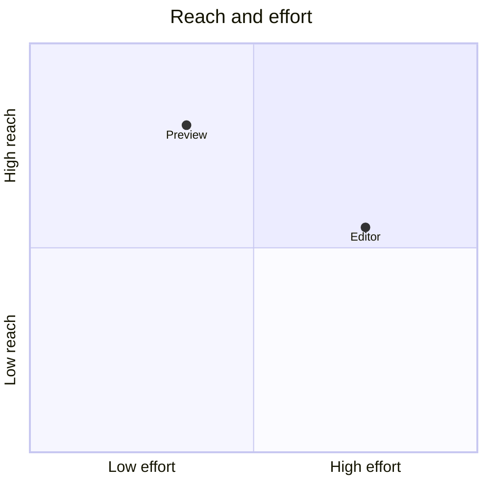

# Models

```mermaid
classDiagram
    class Document {
      +string path
      +render()
    }
    class Diagram {
      +string source
    }
    Document --> Diagram
```

```mermaid
stateDiagram-v2
    [*] --> Reading
    Reading --> Filtering: slash
    Filtering --> Reading: escape
    Reading --> [*]
```

```mermaid
erDiagram
    FOLDER ||--o{ FILE : contains
    FILE ||--o{ DIAGRAM : includes
```

```mermaid
gitGraph
    commit
    branch review
    checkout review
    commit
    checkout main
    merge review
```

```mermaid
quadrantChart
    title Reach and effort
    x-axis Low effort --> High effort
    y-axis Low reach --> High reach
    Preview: [0.35, 0.8]
    Editor: [0.75, 0.55]
```
