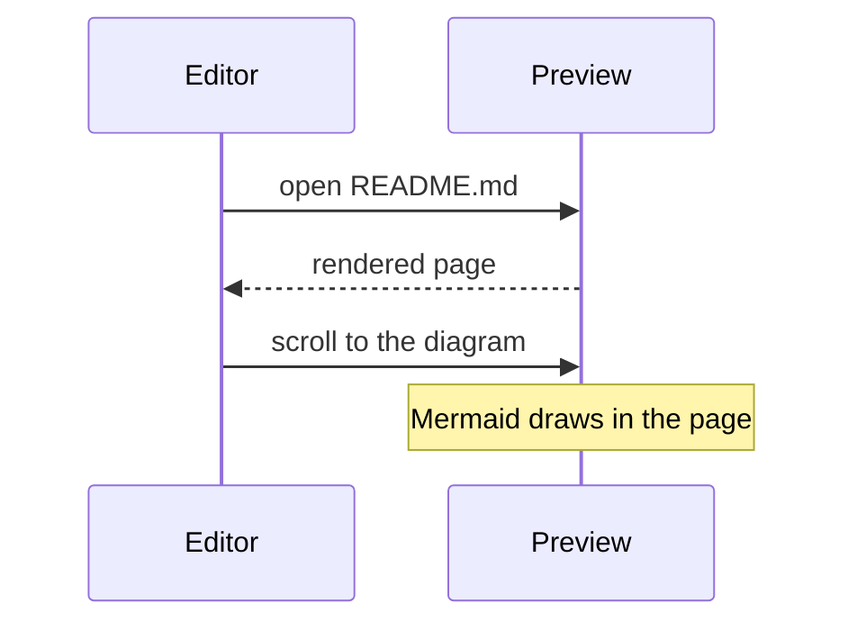

# Editor and preview

```mermaid
sequenceDiagram
    participant Editor
    participant Preview
    Editor->>Preview: open README.md
    Preview-->>Editor: rendered page
    Editor->>Preview: scroll to the diagram
    Note over Preview: Mermaid draws in the page
```

The preview keeps the file tree in place while the note changes.
